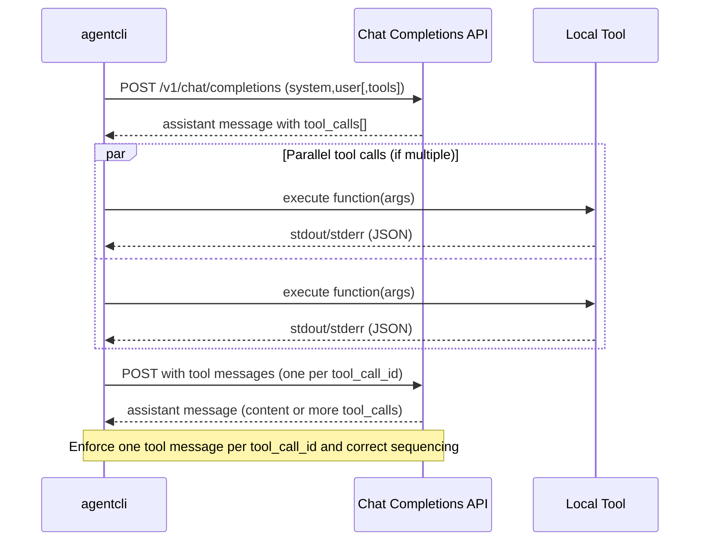

# ADR-0004: Default LLM Call Policy

Status: Accepted
Date: 2025-08-16

Context
The agent CLI integrates with OpenAI-compatible Chat Completions APIs and invokes local tools. Sampling controls (e.g., temperature) vary by provider and model capability. Prior defaults were inconsistent across docs and code, and failure handling around unsupported parameters led to fragile behavior. We need a clear, deterministic policy for defaults, capability-based omissions, and lightweight recovery to preserve parity across providers while remaining robust.

Decision
- Default temperature is 1.0. This matches common provider defaults and avoids under-sampling by default.
- Capability-based omission: when a model or provider does not support temperature (or signals it via error), omit the parameter from the payload.
- One-knob-at-a-time: if the user sets top_p explicitly, do not send temperature in the same request.
- GPT-5 controls: when supported by the selected model, allow users to set `verbosity` (low|medium|high) and `reasoning_effort` without affecting the sampling default; these controls are independent of temperature.
- Observability: record fields temperature_effective (final value used after clamps/omissions) and temperature_in_payload (bool) in structured logs.
- Guardrails: keep the agent loop bounded with a default max steps of 8 (hard wall may be higher internally) and enforce correct tool-call sequencing.
- Lightweight recoveries:
  - Parameter-recovery retry: on a 400 indicating invalid/unsupported temperature, strip it and retry once before normal retry/backoff.
  - Length backoff: on finish_reason == "length" (or equivalent), raise the cap once within budget and retry.

Consequences
- Requests default to temperature=1.0 unless explicitly incompatible or top_p is set.
- Some models will receive no temperature parameter. Behavior remains provider-default in those cases.
- Some providers/models may restrict or ignore sampling knobs. The agent omits unsupported fields and clamps values within provider-accepted ranges when applicable.
- Logs are clearer for debugging sampling choices and automatic recoveries.
- Tests and docs must align to a single canonical default and sequencing rules.

Alternatives Considered
- Default temperature 0.2 (deterministic-first). Rejected for general users: too conservative and diverges from provider defaults.
- Always send both temperature and top_p. Rejected: conflicts with provider guidance; harder to reason about effects.
- Hard-fail on parameter errors without recovery. Rejected: fragile integration and poor UX.

Mermaid sequence of tool-call flow

Rollout Notes
- Update README and reference docs to state temperature=1.0 default and one-knob rule, and to document observability fields.
- Add unit/integration tests for parameter-recovery, one-knob enforcement, and length backoff as incremental slices.

Addendum (2025-08-17)

This addendum clarifies that the project standardizes on a default `temperature=1.0` for API parity and GPT-5 compatibility. Models that do not accept a temperature parameter will receive no `temperature` in the payload; behavior in those cases remains provider-default. The one-knob rule remains in effect: when users specify `top_p`, the agent omits `temperature`; when `top_p` is not provided, the agent sends `temperature` (default 1.0) and leaves `top_p` unset. The docs index now links to this ADR to surface the policy.
