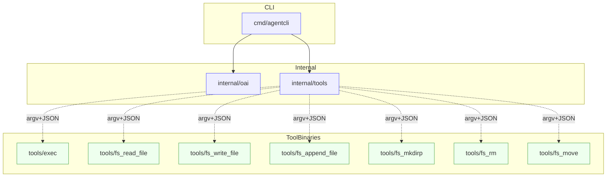

## Architecture: Module Boundaries and Allowed Imports

This repository follows a strict layering model to keep dependencies clear, avoid cycles, and enable fast, deterministic testing.

### Layers and allowed imports
- `cmd/agentcli`
  - Entry point only. Wires flags, configuration, and calls into `internal/*` packages.
  - Allowed imports: standard library, `internal/oai`, `internal/tools` (runner/manifest), and other leaf `internal/*` utilities.
  - Not allowed: importing anything under `tools/` (those are standalone binaries), or third‑party HTTP/tool wrappers beyond what `internal/*` exposes.

- `internal/oai`
  - OpenAI‑compatible API client and request/response types.
  - Allowed imports: standard library only (e.g., `net/http`, `encoding/json`, `context`).
  - Not allowed: importing `cmd/` or any `tools/` binaries. Keep independent from tool execution.

- `internal/tools`
  - Tool manifest loader and secure runner that executes external tool binaries via argv (no shell).
  - Allowed imports: standard library only, plus other small `internal/*` helpers if introduced.
  - Not allowed: importing `cmd/` or `tools/` source code. Communicates with tools solely via argv + JSON stdin/stdout.

- `tools/*` (binaries)
  - Each file under `tools/` builds to a standalone binary (e.g., `tools/fs_read_file`, `tools/fs_write_file`, `tools/exec`).
  - Allowed imports: standard library only.
  - Not allowed: importing from `internal/*` or `cmd/`. Tools are process‑isolated and talk via JSON contracts.

Rationale: The CLI (`cmd/agentcli`) depends on `internal/*`, which depend only on the standard library. The `tools/*` binaries are leaf executables with no reverse imports, ensuring the agent can evolve independently from tool implementations and vice versa.

### Module relationships

### Guidance for adding a new package
- New internal package under `internal/<name>`:
  - Keep dependencies to the standard library and other `internal/*` leaf utilities.
  - Do not import from `cmd/` or `tools/`.
  - Provide small, explicit exported APIs with clear documentation and unit tests.
- New tool binary under `tools/<name>.go`:
  - Treat it as an independent `main` that reads a single JSON object from stdin and writes a single‑line JSON result (or error) to stdout/stderr.
  - No imports from `internal/*` or `cmd/`. Use only the standard library.
  - Add focused unit tests (in `tools/<name>_test.go`) that build and run the tool as a subprocess.
- Build rules:
  - Ensure `make build-tools` (or `go build -o tools/<name> ./tools/<name>.go`) produces a reproducible static binary.
- Contracts:
  - Keep JSON schemas documented in `tools.json` and `README` examples. Validate inputs strictly and fail fast on contract violations.

### Enforcement ideas (non-blocking)
- Consider a lightweight import linter (e.g., staticcheck configuration or a custom script) in CI that rejects cross‑layer imports. This document is the normative policy; automation may follow.
