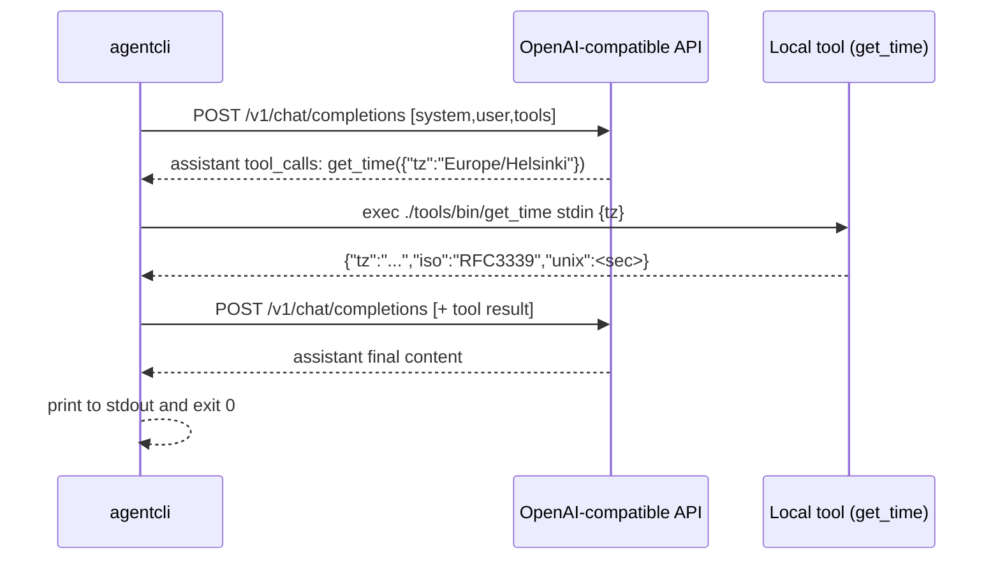

```mermaid
sequenceDiagram
    participant CLI as agentcli
    participant API as OpenAI-compatible API
    participant TOOL as Local tool (get_time)

    CLI->>API: POST /v1/chat/completions [system,user,tools]
    API-->>CLI: assistant tool_calls: get_time({"tz":"Europe/Helsinki"})
    CLI->>TOOL: exec ./tools/bin/get_time stdin {tz}
    TOOL-->>CLI: {"tz":"...","iso":"RFC3339","unix":<sec>}
    CLI->>API: POST /v1/chat/completions [+ tool result]
    API-->>CLI: assistant final content
    CLI-->>CLI: print to stdout and exit 0
```