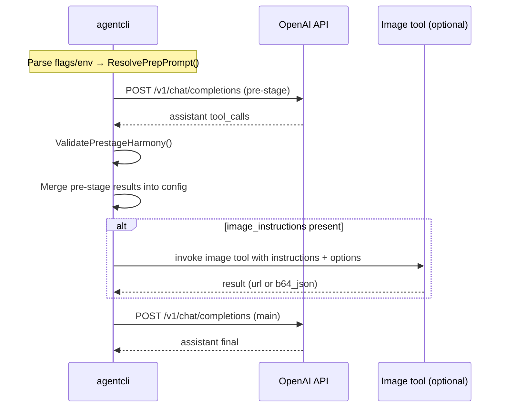

# Pre-stage execution flow

```mermaid
sequenceDiagram
    participant CLI as agentcli
    participant API as OpenAI API
    participant IMG as Image tool (optional)

    Note over CLI: Parse flags/env → ResolvePrepPrompt()

    CLI->>API: POST /v1/chat/completions (pre-stage)
    API-->>CLI: assistant tool_calls

    CLI->>CLI: ValidatePrestageHarmony()
    CLI->>CLI: Merge pre-stage results into config

    alt image_instructions present
        CLI->>IMG: invoke image tool with instructions + options
        IMG-->>CLI: result (url or b64_json)
    end

    CLI->>API: POST /v1/chat/completions (main)
    API-->>CLI: assistant final
```
