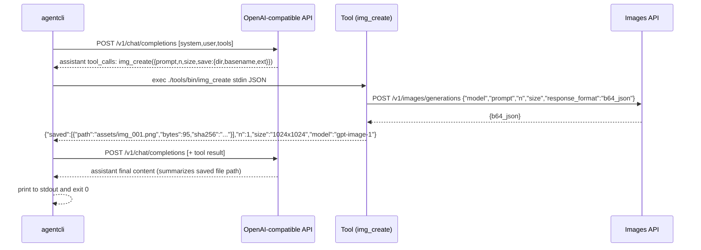

```mermaid
sequenceDiagram
    participant CLI as agentcli
    participant API as OpenAI-compatible API
    participant IMG as Tool (img_create)
    participant IMGAPI as Images API

    CLI->>API: POST /v1/chat/completions [system,user,tools]
    API-->>CLI: assistant tool_calls: img_create({prompt,n,size,save:{dir,basename,ext}})
    CLI->>IMG: exec ./tools/bin/img_create stdin JSON
    IMG->>IMGAPI: POST /v1/images/generations {"model","prompt","n","size","response_format":"b64_json"}
    IMGAPI-->>IMG: {b64_json}
    IMG-->>CLI: {"saved":[{"path":"assets/img_001.png","bytes":95,"sha256":"..."}],"n":1,"size":"1024x1024","model":"gpt-image-1"}
    CLI->>API: POST /v1/chat/completions [+ tool result]
    API-->>CLI: assistant final content (summarizes saved file path)
    CLI-->>CLI: print to stdout and exit 0
```