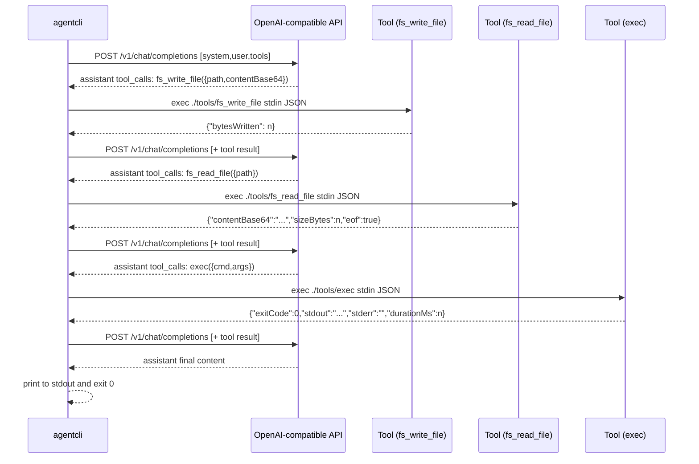

```mermaid
sequenceDiagram
    participant CLI as agentcli
    participant API as OpenAI-compatible API
    participant T1 as Tool (fs_write_file)
    participant T2 as Tool (fs_read_file)
    participant T3 as Tool (exec)

    CLI->>API: POST /v1/chat/completions [system,user,tools]
    API-->>CLI: assistant tool_calls: fs_write_file({path,contentBase64})
    CLI->>T1: exec ./tools/fs_write_file stdin JSON
    T1-->>CLI: {"bytesWritten": n}
    CLI->>API: POST /v1/chat/completions [+ tool result]
    API-->>CLI: assistant tool_calls: fs_read_file({path})
    CLI->>T2: exec ./tools/fs_read_file stdin JSON
    T2-->>CLI: {"contentBase64":"...","sizeBytes":n,"eof":true}
    CLI->>API: POST /v1/chat/completions [+ tool result]
    API-->>CLI: assistant tool_calls: exec({cmd,args})
    CLI->>T3: exec ./tools/exec stdin JSON
    T3-->>CLI: {"exitCode":0,"stdout":"...","stderr":"","durationMs":n}
    CLI->>API: POST /v1/chat/completions [+ tool result]
    API-->>CLI: assistant final content
    CLI-->>CLI: print to stdout and exit 0
```